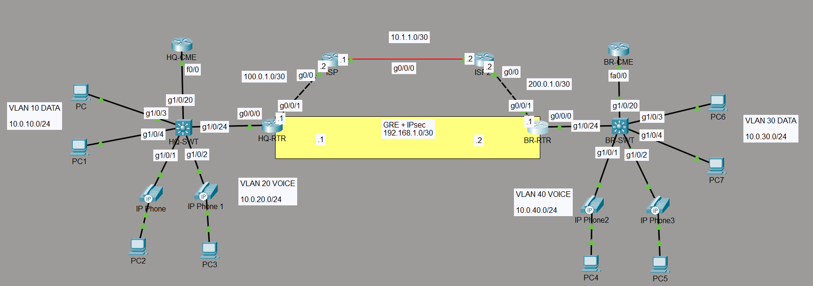

# GRE + IPsec Site-to-Site VPN Lab

Site-to-site tunnel connecting an HQ router and a Branch router across a
simulated ISP transport network, with GRE providing the tunnel and IPsec
encrypting the traffic inside it. OSPF runs over the tunnel to exchange
routes dynamically between sites.

## Topology

- **Underlay**: HQ-RTR (100.0.1.1) ↔ ISP ↔ ISP2 ↔ BR-RTR (200.0.1.1),
  reachability handled with static routes
- **Overlay**: GRE Tunnel0 (192.168.1.0/30) between HQ-RTR and BR-RTR,
  encrypted with IPsec (AES, pre-shared key)
- **OSPF** runs over Tunnel0 so each site learns the other's LAN subnets
  (10.0.10.0/24, 10.0.20.0/24 ↔ 10.0.30.0/24, 10.0.40.0/24) without
  manual static routes

## What this covers
- GRE tunnel configuration between two sites
- IPsec (ISAKMP/IKE Phase 1 + IPsec Phase 2) encrypting GRE traffic,
  matched with a crypto ACL (`match address 110`)
- OSPF neighbor adjacency and route exchange over a GRE tunnel
- Underlay vs overlay separation - the transit network (ISP/ISP2) only
  needs static routes to the tunnel endpoints; it has no visibility into
  OSPF or the sites' internal VLANs

## Key issues hit and resolved
- ISP and ISP2 had no route to each other's far-side subnet, so the
  tunnel endpoints couldn't reach each other even though each site had a
  working default route to its own ISP
- Verified the tunnel was passing real traffic (not just a Phase 1
  handshake) using `show crypto ipsec sa` packet counters
- Confirmed OSPF adjacency reached `FULL` state and LAN routes were
  learned across the tunnel using `show ip ospf neighbor` and
  `show ip route ospf`

## Configs
See [`/configs`](./configs) for HQ-RTR and BR-RTR running-configs (ISP
and ISP2 are simple static-route transit routers, not included).
